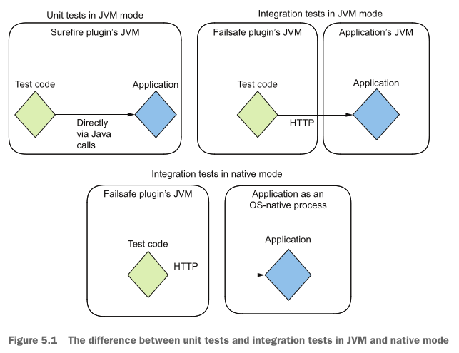
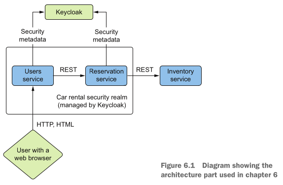

#### Quarkus in Action (eBook/pdf)

# [1] 📚 🚀

A “Kubernetes Native Java stack tailored for OpenJDK HotSpot and GraalVM, crafted from the best of breed Java libraries
and standards”.

"Pod" as the central Kubernetes resource. App containers run inside a pod. Each pod may be replicated.
A JVM container contains the App > JVM > glibc & env configs (JAVA_HOME).

Imperative & Reactive programming paradigms work seamlessly together.

# Quarkus architecture

### Execution environment

- JIT / HotSpot (JVM)
- AOT / GraalVM Native Image: compiles .java into native binaries

### Core

- Jandex: indexing of classes to a class model representation that is mem efficient & fast to search
- Gizmo: a bytecode (= javac output the JVM executes) manipulation lib
- Graal SDK
- Config: extensions for build- or runtime features
- ArC: the dependency injection framework (implements the CDI spec)

### Extensions

- REST
- Netty
- Hibernate Validator
- ...

# Demo app "Acme Car Rental"

- https:#github.com/xstefank/quarkus-in-action
- Uses different communication technologies (REST, GraphQL, RabbitMQ, Kafka, gRPC) between independent (micro)services.

## Create (1st) Quarkus app via

- mvn plugin
- Quarkus CLI
- website's GUI

The generated project has std (Java) Maven structure

- pom.xml: represents mvn build config file
- src/main/java: source code
- src/main/resources: non-source code-related config files or HTML pages
- src/main/docker: generated Dockerfiles (not typically incl. in mvn projects)
- src/test/java
- Maven wrapper: a set of files (mvnw, mvnw.cmd, .mvn) to allow project build without having mvn installed

## pom.xml

	<dependencies>
	Quarkus extensions (groupId "io.quarkus") are implicitly included; versions are collectlively defined in the Quarkus Bill of Materials (BOM) -> <dependencyManagement> -> ensures that all extensions are guaranteed to work together

	<build> <plugins>
	- quarkus-maven-plugin: to package the app in the correct target artifacts
	- maven-compiler-plugin, maven-surefire-plugin, maven-failsafe-plugin: to pass additional config params to the Java compiler and the test execution

	<profiles>
	- native (GraalVM executable file)

## generated code & resources

- the `quarkus-rest` extension (as every extension may do) contributes some sample code => GreetingResource.java
- src/main/resources/application.properties: default config location; 1 of possibly many config properties (env
  variables, system properties, ...)
- src/main/docker: Dockerfiles to build images based on different distros & packaging types
- src/main/test: auto-generated test classes GreetingResourceTest.java, GreetingResourceIT.java (additional integration
  test because the JVM runs - unit tests in the same JVM - separately from the quarkus app artifact - only way to
  execute tests next to a native image/container is to run them in their own JVM)

## Run the app (with normal JDK `java -jar`)

`$ ./mvnw quarkus:dev` or `$ quarkus dev` (Quarkus CLI)
=> dev mode dynamically recompiles & runs the app without manual building/packaging

For platform packaging:
`$ ./mvnw package` or `quarkus build`
`$ ./mvnw clean package` or `quarkus build --clean`

/target/quarkus-app/ contains JVM executable `quarkus-run.jar`
`$ java -jar target/quarkus-app/quarkus-run.jar` runs app in "prod mode" (this no longer includes dev mode welcome page
http:#localhost:8080/q/dev-ui/welcome)

## Native compilation with GraalVM (a "high-performance JDK")

GraalVM's main feature: native-image = AoT Java-to-binary compilation specific to a CPU architecture and OS

JVM compilation & execution:
e.g. mvn package => .java files => .class bytecode (is platform-independent) => java -jar => computer uses JVM to
interpret bytecode into machine code

Native compulation & execution:
e.g. mvn package -Pnative => .java classes => machine code => computer directly runs machine code (without a JVM)

## Packaging Quarkus as a native executable (with container build)

`$ ./mvnw package -Pnative` or `$ quarkus build --native` (uses container - docker, podman - build if GRAALVM_HOME is
not set)
=> creates native exe (linux binary): `$ ./target/quarkus-in-action-1.0.0-SNAPSHOT-runner`

## Performance brrr

Quarkus does build-time (AoT) instead of runtime processing

during build-time:

- load, parse config (during runtime in traditional frameworks)
- analyse dependencies (during runtime in traditional frameworks)
- build dependency tree (during runtime in traditional frameworks)
- package app

during runtime:

- execute code

## JVM (JIT) vs compile-to-native (AoT)

depends on target use case; JVM JIT compiler optimises code during runtime (hot spot detection, method inlining, dead
code elimination, ...) ev. outperforming statically compiled (AoT) native images
i.e. JVM usually outperforms native for long-running processes (but it takes time to reach peak)

JAR

- slow(er) startup time
- high(er) mem usage
- benefits from JVM optimisations (peak throughput per invocation exceeds Native/AoT)
- for long-running, always-on microservices

Native

- rapid startup time
- low mem usage
- for serverless and short-lived tasks

## Building container images

see comments in respective Dockerfile (src/main/docker)

## Extensions

- from a dev's pov: a module providing additional funcitonality by integrating a lib or framework with the quarkus core
- are managed as mvn dependencies
- see "Quarkus architecture" above

`$ quarkus ext categories` lists available extensions `--full` (incl. guide link)
add:    $ quarkus ext add "<artifact-id>"
remove: $ quarkus ext remove "<artifact-id>"

Quarkiverse: a community-driven extension hub

# Enhancing DX

## Dev Mode

"Dev Services" spins up disposable instances of remote services like a DB, messaging broker, etc.
"Dev mode" enables "live coding" (auto-reloading similar to scripting languages) and "continuous testing" =
automatically executes tests in the background
possible thanks to a class loader architecture that reuses a single JVM for running multiple isolated versions of the
app in parallel

## App config

Each added extension contributes a set of props that you can configure => src/main/resources/application.properties
Inject props with @ConfigProperty someVar

Config profiles
For different lifecycle stages
By default: prod (active in prod mode), dev (active in dev mode), test (active during tests)
Prefix properties for respective profile - e.g. `%dev.quarkus.http.port=7777`
or use separate .properties files - e.g. `application-dev.properties`
Dynamic value config not possible with application.properties since this file is incl. in the compiled artifact
-> overriding config with (1.) JVM system props and (2.) env variables (application.properties has 3rd prio)
e.g. $ MY_GREETING="Env var value" quarkus dev -Dgreeting="Sys prop val"

## Dev UI -> http:#localhost:8080/q/dev-ui

An interactive browser-based (dev mode) tool to gain app insights
E.g. list config keys / values, detected CDI beans, JPA entities, interact with local db, rerun unit tests, view test
reports, ...
Allows manipulating the app - e.g. application.properties, triggering scheduled events out of schedule, wiping DBs, etc.

## Dev Services

Designed to work only in dev mode & during tests - not in prod
Require/use Docker (or Podman) containers to run underlying services
Example: Securing app using OIDC auth layer

- Quarkus Dev Services spins up a 'Keycloak' (OIDC provider) instance
- Use Dev UI to obtain a sec token from embedded Keycloak
- Use token to send a request to the app and verify logged-in user

  `$ quarkus extension add oidc`
  Keycloak provider default auth/login: usr=alice, pwd=alice
  => generates Access token (append to request header as `Bearer`) & ID token

## Continuous testing - `r`

Taking live reloading one step further - also rerun your tests along with it!
Those tests do not affect the app's state bc they run in a separate class loader
Dev UI card (> Continuous Testing) shows test reports (may not incl. all the info from target/surefire-reports and
target/failsafe-reports
Tightly integrated with JUnit5

*** 

# [2] Developing Quarkus Apps

Quarkus integrates most popular Java frameworks & libs

- Remote communication
- Testing
- Frontend
- Security
- DB access
- Reactive programming

## 4 - Handling communications

we will focus on synchronous client-server communication

Exposing & consuming APIs using these network protocols

- HTTP with REST
- GraphQL (good for limiting #requests where amount of transferred data is critical)
- gRPC (high-performance, open source universal RPC framework)


## Car Rental Microservices

- localhost:8080 => Users
- localhost:8081 => Reservation
- localhost:8082 => Rental
- localhost:8083 => Inventory
- localhost:8084 => Billing

## REST

the `quarkus-rest` ext is used for server side and impl. JAX-RS (annotations)

creating the car rental app: $ quarkus create app org.acme:reservation-service --extension
quarkus-rest-jackson,quarkus-rest-client-jackson,quarkus-smallrye-openapi --no-code

[Reservation service]
package org.acme.reservation
.inventory
Car` model
	communication to Inventory is abstracted via `InventoryClient` interface	
	`InMemoryInventoryClient`
.reservation
	`Reservation` model
	`ReservationsRepository` interface models interactions with the persistence layer
	`InMemoryReservationsRepository`
.rest
ReservationResource

[Rental service]
`Rental` model
`RentalResource`

communicating between reservation and rental service via `@RestClient RentalClient` - see ReservationResource.java

## GraphQL

- a client query language that avoids over-/under-fetching => decreases # requests hence network traffic
- well suited for resource-restricted environments e.g. mobile apps
- client interacts with contract-defined "operations"
    - `Query` (like Select, Get)
    - `Mutation` (like Update, Insert, Put)
    - `Subscription`: stream of responses in which items appear over time; use for events on the data; usually
      implemented using WebSockets

### `Reservation`

- acts as GraphQL client (typesafe or dynamic)
- `@GraphQLClientApi(configKey = "inventory")`
- app.props: `quarkus.smallrye-graphql-client.inventory.url=http://localhost:8083/graphql`

### `Inventory`

- acts as GraphQL server
- `@GraphQLApi`

send request (HTTPie): `$ http :8081/reservation/availability`

## gRPC

- an open source framework for remote process communications
- more compact and efficient than HTTP - uses binary protocol
- gRPC (and HTTP/2) support(s) multiplexing - multiple concurrent requests before receiving responses
- HTTP/1 does not support multiplexing - requests / responses are serialized one after another

### Protocol Buffers - protobuf

- language-independent binary (or text) message format
- smaller and faster to (de)serialize than JSON (but not human-readable)
- has schema definition - `.proto` file

add `quarkus-grpc` ext to [generate Java code from .proto file(s)](../inventory-service/src/main/proto/inventory.proto)
via `$ mvn clean package`

(quarkus-grpc replaces StreamObserver API - used by protoc compiler - with Mutiny)

=> Implement generated `InventoryService` to expose it via gRPC

generated RPC methods `add()`, `remove()` returning `Uni` (= stream that emits a single item or a failure)

gRPC server automatically starts on port 9000 - send request via Dev UI / gRPC Services (does not require implementing a
client or use external tools like `grpcurl`)

### gRPC & Streams

return multiple responses (`stream`) instead of `Uni`

#### 4 basic classes of gRPC services

- `Unary` - single request, single response
- `Server streaming` - returning n responses per call *
- `Client streaming` - returning n responses per call **
- `Bidirectional streaming` * ** - `Multi` as in-/output type wrapper

### Using a gRPC client - `inventory-cli`

- `quarkus.grpc.clients.{client-name}.host` - the target server host
- `quarkus.grpc.clients.{client-name}.port` - the target server port

impl: `InventoryCommand.java`

send request: `$ java -jar target/quarkus-app/quarkus-run.jar add KNIGHT Pontiac TransAM`

## 5 - Testing

### @QuarkusTest

enables CDI injection

### Native testing - @QuarkusIntegrationTest

- Quarkus' 1st class integration with GraalVM and compiling into native binaries naturally extends to testing as well
- possible to run same tests in JVM and native mode
- Mocking, CDI and continuous testing are not supported in native mode - need to execute separate maven (or gradle)
  build

Unit vs Integration test (JVM vs Native mode)


create a @QuarkusIntegrationTest and an existing JVM test - run it `$ ./mvnw verify -Pnative`

### Mocking

technique used to run high-level test programs that include components not suitable for the test env (e.g. costly
services)

#### Replacing implementations (CDI beans)

`@Alternative` along with `@Priority(1)` => Quarkus built-in `@Mock`

```java 
// CDI container now chooses this impl over the GraphQLInventoryClient one
@Mock
public class MockInventoryClient implements GraphQLInventoryClient
```

#### _Mockito_ (framework)

```xml
<!-- Mockito -->
<dependency>
    <groupId>io.quarkus</groupId>
    <artifactId>quarkus-junit5-mockito</artifactId>
    <scope>test</scope>
</dependency>
```

# 6 - Exposing & Securing Web Apps

touched OIDC and keycloak previously, build upon that now

`UserService` passes "security context" to `ReservationService`

Also add a little **frontend**

- _Qute_: server-side templating engine (core Quarkus ext)
- _HTMX_: client-side toolkit simplifying async communication with the backend - AJAX

# 7 - DB Access

## Transactions

- important for data access in distributed environments
- Quarkus (has integrated transaction manager and) transitively includes transactions when needed
- handling txs
    - declarative: `TxType.REQUIRED, .REQUIRES_NEW, ...`
    - manual: `QuarkusTransaction.begin(), .commit(), ...`

### TXs with Panache

- every op that modifies the db (persist, update) must execute inside a tx
- Hibernate requires the tx to propagate the in-memory changes into the downstream db
- changes made to an entity propagate to the db in a batch ("flush") => actual SQL
- Hibernate _**flushes**_ at the end of each tx (before committing it)

#### checked (handled) exception => commits

#### runtime exception => rollbacks

# [3] Quarkus in the cloud and beyond

tbd 
 